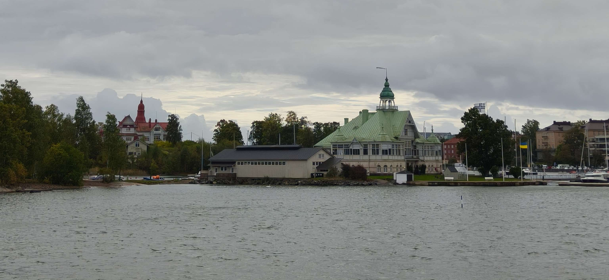
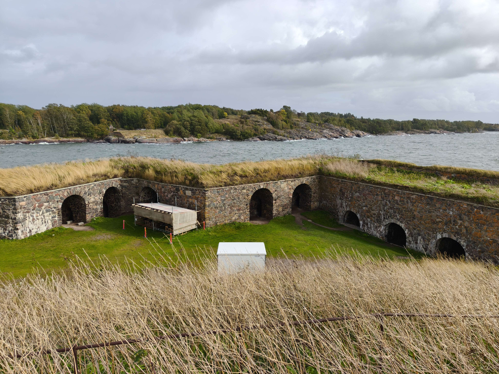
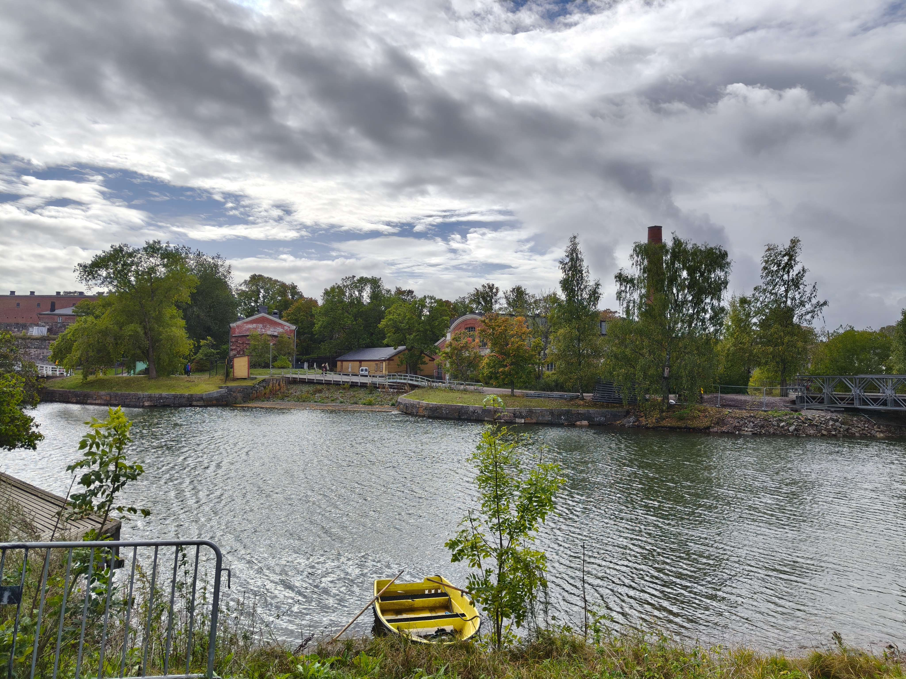
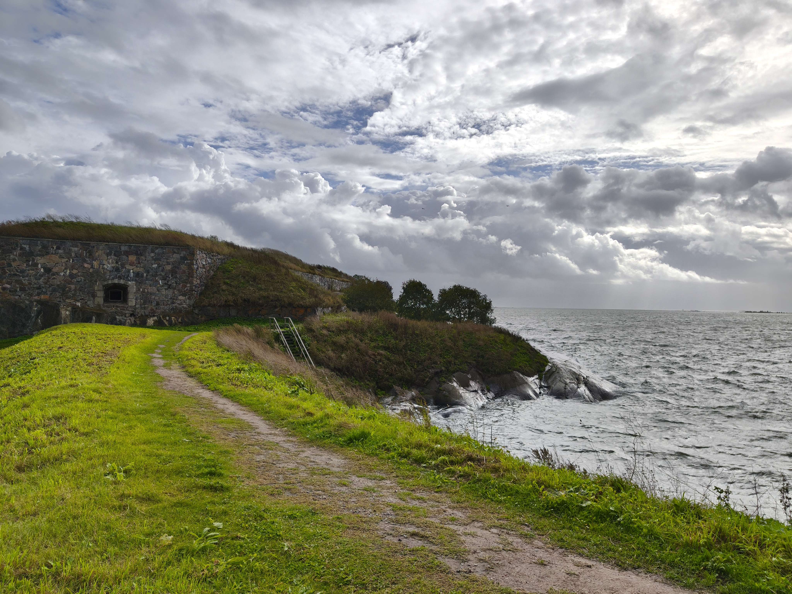
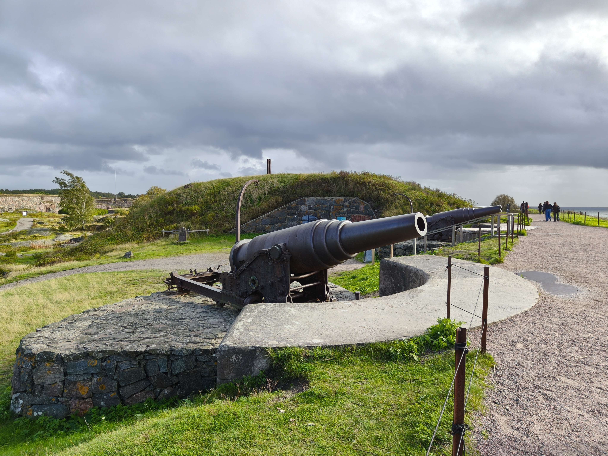
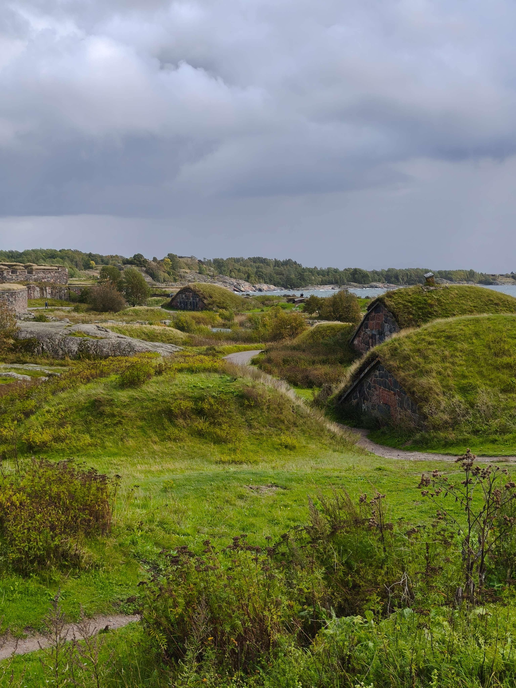
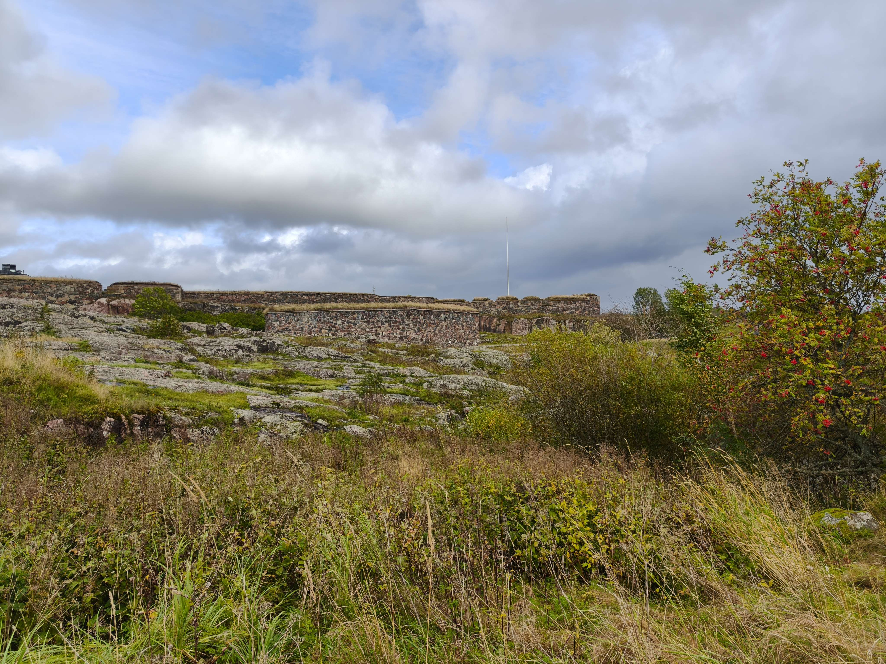

Weekend sudah datang, yey! Hari ini sama mama pergi ke Suomenlinna.

Fun facts about Suomenlinna:
- Benteng laut di sebuah pulau kecil di Finland dibangun 1748.
- Waktu dibangun, Finland masih di bawah Sweden. Habis itu di bawah Russia ketika masa perang Russia-Sweden selama tahun 1800-an. 
- Setelah Finland merdeka,  Suomenlinna ini perannya jadi base militer sebelum dilestarikan jadi cultural heritage sekarang (UNESCO list) :D.

Untuk ke sana, kita naik ferry, bisa pakai tiket A-B zone dari HSL app. Durasi perjalanannnya 15 menit, singkat sekali. Tiket HSL bisa dipakai buat naik semua jenis transportasi umum: kereta, tram, bus, sampai ferry ini.

Setelah sampai, kita bisa ambil brosur berisi peta Suomenlinna, ada rute biru untuk lewatin main tourist attractionsnya. Ada banyak petunjuk jalan juga kalau bingung ke arah mana.

Ini bangunan yang langsung kita ketemu pas turun dari ferry.

First stop: Suomenlinna kirkko (church). Ada yang lagi wedding ceremony di sini. Sempat lihat rombongannya, pernikahan di sini sangat simple dan kecil.

Habis itu kita jalan melewati dinding benteng dan perumahan sekitar. Lingkungan alam dan arsitektur di sini berasa sangat kuno, kayak di abad 17 kata mamaku hahaha. Tapi aesthetic, tenang, dan tradisional.

Ada satu spot yang aku suka banget. Di sini viewnya cantik, kelihatan semua elemennya: rumah tradisional, air, perahu, jembatan, rumput, dan pohon-pohon. Semuanya nyatu, hehehe.

Berjalan lagi, ke daerah benteng-bentengnya. Sempat masuk ke dalam, gelap dan berpasir. Tidak kebayang dulu zaman perang orang-orang tinggal di dalam sini bagaimana.

Setelah keluar dari sana, kita ketemu monumen yang ada zirah prajurit.

Dari situ, jalan berbelok arah dari rute biru. Ketemu spot yang sangat indah :'D.

Di sini ada beberapa benteng mini yang bentuknya kayak rumah kurcaci dan atas atapnya berumput. View-nya langsung menghadap ke laut dengan awan awan di atasnnya. Terus sempat secercah cahaya menembus awannya di tengah, menyinari bagian kecil permukaan lautnya di tengah kegelapan. Sangat indah.

Tapi anginnya sangat amat kencang wkwkwk.

Kembali ke main route biru, kita jalan ke Kings Gate. Di sini, ada lebih banyak lagi rumah-rumah kurcaci prajurit. Banyak meriam menghiasi penjuru benteng di tepi lautnya. Kayak di negeri dongeng "Benteng rumput para prajurit kurcaci bersenjatakan meriam".

Benteng mini rumputnya juga mengingatkanku ke hadiah boneka sapi yang bisa tumbuhin rumput di atasnya kalau disiram air. Dulu waktu kecil, aku sering dapat hadiah itu dari event gereja, sangat lucu hehehe.

That's the end of today's journey. Aku dan mama balik lagi ke pelabuhan sambil jalan santai. Thank you for reading my story!